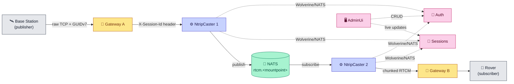
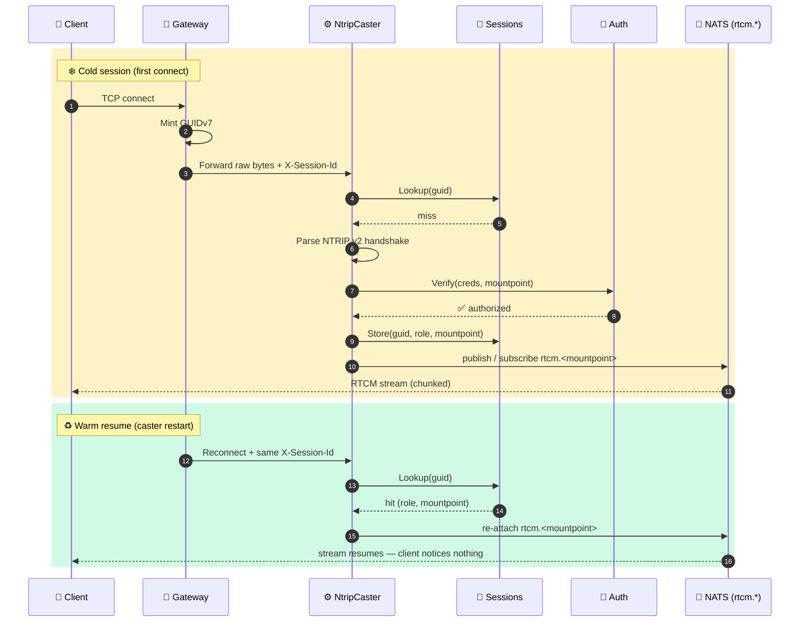

# 🛰️ MyNtripCaster

A simple, scalable **NTRIP v2** caster. Relays RTCM correction streams from GNSS base stations to rovers over HTTP/1.1 chunked — built to run horizontally behind thin connection-holding gateways so clients stay online through caster restarts.

> 🚧 **Status:** early scaffolding. Architecture is defined in [`CLAUDE.md`](./CLAUDE.md); code is on the way.

---

## ✨ What it does

- 📡 Speaks **NTRIP v2** to bases (publishers) and rovers (subscribers).
- 🔀 Fans out RTCM between caster instances over **NATS** — scale out by adding nodes, not by vertical scaling.
- 🔁 **Session resumption** via GUIDv7: if a caster restarts, clients stay connected through the gateway and resume seamlessly.
- 🖥️ **Operator UI** (Blazor Server) for live session monitoring and auth configuration.
- 🔭 **Observability by default** — OpenTelemetry traces, metrics, and logs wired from day one.

## 🏗️ Architecture at a glance

The **Gateway** is a dumb TCP connection holder. It mints a per-connection GUIDv7, forwards raw bytes, and transparently reconnects to a healthy caster if the current one dies. All NTRIP protocol logic and authorization live in the **NtripCaster**. The **Sessions** and **Auth** services are called async over NATS so the caster can resume warm sessions without re-handshaking.

Full details, module responsibilities, and conventions are in [`CLAUDE.md`](./CLAUDE.md).

## 🔄 Connection flow: cold vs. warm session

## 🧩 Modules

| # | Module | Role |
|---|---|---|
| 1 | 💾 **Sessions** | Per-GUIDv7 cache: role, mountpoint, auth result, heartbeats |
| 2 | 🔐 **Auth** | Credential verification and mountpoint authorization |
| 3 | ⚙️ **NtripCaster** | The **only** component that parses NTRIP v2; bridges clients ↔ NATS |
| 4 | 🚪 **Gateway** | Thin TCP holder — mints GUIDv7, forwards bytes, transparent reconnect |
| 5 | 🖥️ **AdminUi** | Blazor Server — sessions dashboard + auth config |
| T1 | 🧪 **TestBaseStation** | Simulated base — publishes canned RTCM |
| T2 | 🧪 **TestRover** | Simulated rover — asserts stream correctness |

## 🙌 Open-source shoutouts

Built on the shoulders of these excellent open-source projects — thank you to the maintainers:

### 📚 Libraries

| Project | Purpose | Link |
|---|---|---|
| 🐺 **Wolverine** (JasperFx) | Message bus and mediator (`WolverineFx.NATS` transport) | <https://wolverinefx.net/> |
| 🔀 **NATS** | Message transport (Core NATS + JetStream) | <https://nats.io/> |
| 🔭 **OpenTelemetry** | Traces, metrics, and logs | <https://opentelemetry.io/> |
| 🧪 **xUnit** | Unit testing | <https://xunit.net/> |

### 🤖 Claude Code plugins & skills

Development on this repo is powered by a stack of community Claude Code plugins and skills:

| Plugin / Skill | What it does |
|---|---|
| 🦸 [**superpowers**](https://github.com/obra/superpowers) | Jesse Vincent's toolkit of Claude Code skills and workflows |
| 📖 [**context7**](https://github.com/upstash/context7) | Upstash's MCP server for fetching up-to-date library docs |
| 🎨 [**frontend-design**](https://github.com/anthropics/claude-code) | Design-quality frontend generation |
| 🔍 [**code-review**](https://github.com/anthropics/claude-code) | PR review workflow |
| ⚡ [**claude-code-setup**](https://github.com/anthropics/claude-code) | Automation recommender for Claude Code projects |
| 🛠️ [**csharp-lsp**](https://github.com/anthropics/claude-code) | C# language server integration |
| 🎭 **design-taste-frontend**, **emil-design-eng**, **gpt-taste**, **high-end-visual-design**, **industrial-brutalist-ui**, **minimalist-ui**, **redesign-existing-projects**, **stitch-design-taste**, **full-output-enforcement** | Community UI/UX and output-quality skills that raise the bar on generated code |

## 🤝 Built with Claude Code

This project is being developed with [**Claude Code**](https://claude.com/claude-code), Anthropic's CLI for collaborative software engineering. [`CLAUDE.md`](./CLAUDE.md) serves as both the project charter for humans and the working brief for Claude.

## 📜 License

Licensed under the [Apache License 2.0](LICENSE) — you are free to use, modify, and distribute this software, including in commercial products. Attribution is appreciated but not enforced beyond the license terms.
